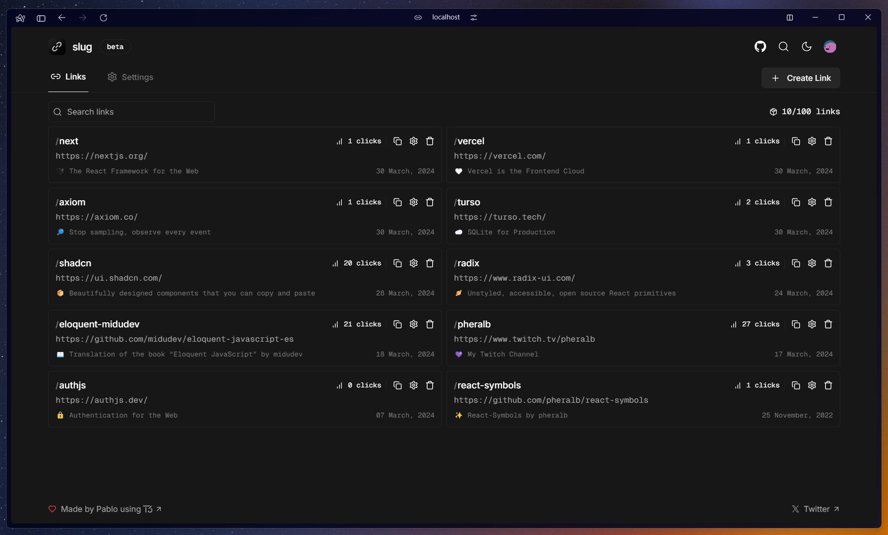

  
  

  

    <b>
      Ein privater, angepasster Fork des Open-Source URL-Shorteners Slug.
    </b>
  

<a href="https://go.sdtoll.de">go.sdtoll.de</a>
&nbsp;&nbsp;❖&nbsp;&nbsp;
<a href="#-funktionen">Funktionen</a>
&nbsp;&nbsp;❖&nbsp;&nbsp;
<a href="#-unterschiede-zum-original">Unterschiede zum Original</a>

> **Hinweis:** Dieses Projekt ist ein privater Fork von [**pheralb/slug**](https://github.com/pheralb/slug). Alle Änderungen sind nur für den persönlichen Gebrauch bestimmt. Die originale Version ist unter [slug.vercel.app](https://slug.vercel.app) verfügbar.

## 🚀 Funktionen

- **🔗 Einfaches Erstellen von Kurz-URLs** – mit benutzerdefinierten Slugs
- **🔒 Passwortgeschützte Links** – erstelle Links, die nur nach Eingabe eines Passworts geöffnet werden können (bcrypt-verschlüsselt)
- **⏩ Direkt-Weiterleitung (`/d/:slug`)** – 302-Redirect ohne Zwischenseite
- **🎣 Rickroll-Route (`/r/:slug`)** – Weiterleitung mit animiertem Rickroll-GIF und Cookie-Consent
- **🌐 Catch-All Slug-Route (`/[...slug]`)** – verarbeitet beliebige Slugs, URLs und Domains direkt
- **📊 Dashboard** – Übersicht, Bearbeiten, Löschen und Suchen aller Links (mit Tag-Filter)
- **🏷️ Tag-System** – organisiere deine Links mit farbigen Tags
- **📱 QR-Code-Generierung** – erstelle QR-Codes direkt aus dem Dashboard
- **📥 Datenexport** – lade alle Links als JSON herunter
- **🍪 Cookie-Consent-System** – steuere Analytics-Einwilligung (Umami + Vercel Analytics)
- **🔒 Login nur für autorisierten Benutzer** – Single-User-Modus (keine Registrierung für Dritte)
- **⚡ Rate-Limiting** – 30 Link-Erstellungen pro Stunde, 5 Passwort-Versuche pro 10 Minuten
- **🇩🇪 Deutsche UI** – komplette deutsche Lokalisierung

## 🛠️ Unterschiede zum Original

Dieser Fork erweitert und modifiziert das originale [**Slug**](https://github.com/pheralb/slug) von [**@pheralb**](https://github.com/pheralb) in folgenden Bereichen:

| Änderung | Beschreibung |
|----------|-------------|
| **Passwortschutz** | Neue `/unlock/:slug`-Route mit bcrypt-Passwort-Hashing für Links |
| **Rickroll-Route** | Neue `/r/:slug`-Route mit animiertem Rickroll und Cookie-Consent |
| **Direktlink-Route** | Neue `/d/:slug`-Route für sofortige 302-Redirects |
| **Catch-All-Route** | `[...slug]` verarbeitet Slugs, URLs und Domains universell |
| **Analytics-Consent** | Umami + Vercel Analytics nur nach Cookie-Einwilligung geladen |
| **Werbung** | Monetag-Ad-Injection (Push, In-Image, Vignette) + Ad-Service-Worker |
| **Single-User** | Login nur für einen GitHub-Account (`SupiDupiToll`), Google OAuth entfernt |
| **Unbegrenzte Links** | Kein Link-Limit pro Benutzer |
| **Rebranding** | Domain geändert zu `go.sdtoll.de`, komplett neues Design (Manrope + Playfair Display, eigenes Farbschema) |
| **Deutsche Lokalisierung** | Komplette UI auf Deutsch inkl. Footer mit Impressum |
| **Sicherheit** | HSTS, X-Content-Type-Options und andere Security-Headers via `next.config.mjs` |
| **Catch-All-Redirect** | URLs wie `/google.com` oder `https://example.com` werden automatisch als Ziel erkannt |
| **Design** | Eigenes Dark-Theme mit `#b7e44b` als Primärfarbe, Glow-Effekten und Material Symbols Icons |
| **Rate-Limiting** | Erweiterte Rate-Limits für Link-Erstellung und Passwort-Versuche |
| **Robots.txt** | Komplette Suchmaschinen-Ausssperrung (`Disallow: /`) |

## 🔑 Tech-Stack

- [**create-t3-app**](https://create.t3.gg)
- [**Next.js 14 App Router**](https://nextjs.org/)
- [**Auth.js v5**](https://authjs.dev/)
- [**Prisma**](https://prisma.io)
- [**Turso**](https://turso.tech/) (SQLite) + [**libSQL**](https://github.com/tursodatabase/libsql)
- [**Next.js Server Actions**](https://nextjs.org/docs/api-reference/server-actions)
- [**TailwindCSS**](https://tailwindcss.com) + [**shadcn/ui**](https://ui.shadcn.com) & [**Radix Primitives**](https://www.radix-ui.com)
- [**bcryptjs**](https://github.com/dcodeIO/bcrypt.js) – Passwort-Hashing
- [**Lucide Icons**](https://lucide.dev) + [**Material Symbols**](https://fonts.google.com/icons)

## 📝 Lizenz

Dieser Fork steht unter der [GPL-3.0-Lizenz](https://github.com/pheralb/slug/blob/main/LICENSE) des Originalprojekts von [**pheralb**](https://github.com/pheralb/slug).
